  <h1>Hi there, I'm Alan Varela 👋</h1>
  <h3>Software Engineering Student | Backend & Cloud Developer</h3>

  

    based in <b>Zapopan, Jalisco, Mexico</b> 🇲🇽
  

  
  

 

## About Me

I am a **Software Engineering** student at **ITESO, Universidad Jesuita de Guadalajara**, expected to graduate in 2027 (**GPA 9.33/10**).

I enjoy **backend development, system design, and working in the cloud**. I build APIs in **TypeScript/Node.js** and **Java**, deploy them on **AWS**, and I am currently diving into **distributed systems**.

* **Current Focus:** Backend, Cloud Architecture & Distributed Systems.
* **Languages:** Spanish (Native), English (C1 Advanced - TOEFL ITP: 620/677).
* **Interests:** Trail Running, Mountaineering.

---

## Featured Projects

* ⚙️ **[Bookio Backend](https://github.com/AlanDVarela/bookio-backend)**: multi-tenant appointment-booking SaaS. REST API in TypeScript/Express on AWS EC2, PostgreSQL on RDS (Prisma), Firebase Authentication with role-based access control, SQS for asynchronous email processing, S3 and Secrets Manager.
* 🕸️ **Distributed Fraud Detection System**: multi-model database architecture (Cassandra, MongoDB, Dgraph) with graph algorithms to detect circular transfers and transaction rings, fully containerized with Docker.
* 🏗️ **Kubico**: construction management system in Node.js/TypeScript with a centralized pricing catalog and automatic cost propagation.

---

## Technical Stack

### Languages

### Databases

### Cloud & DevOps

---

## GitHub Stats

  

  

 
